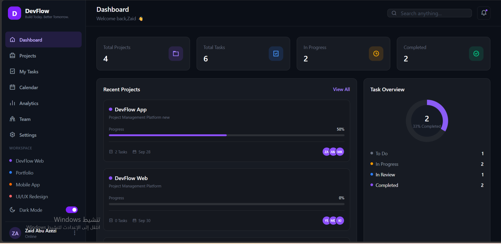
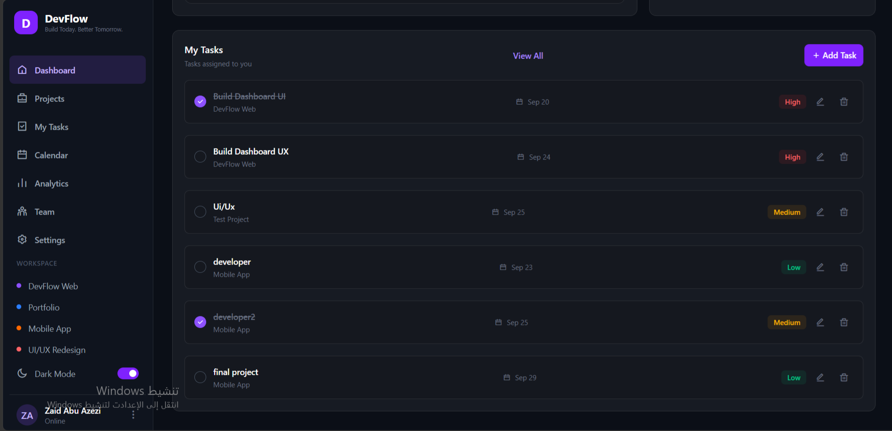
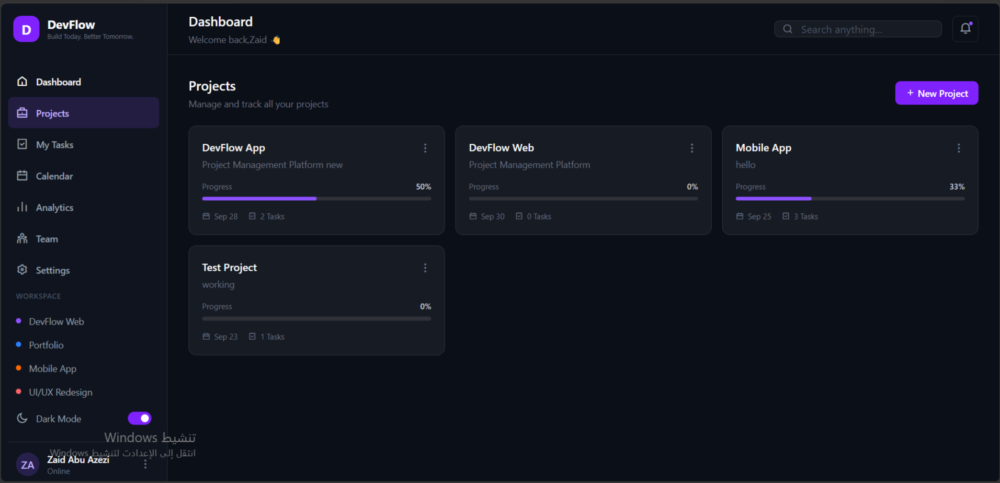
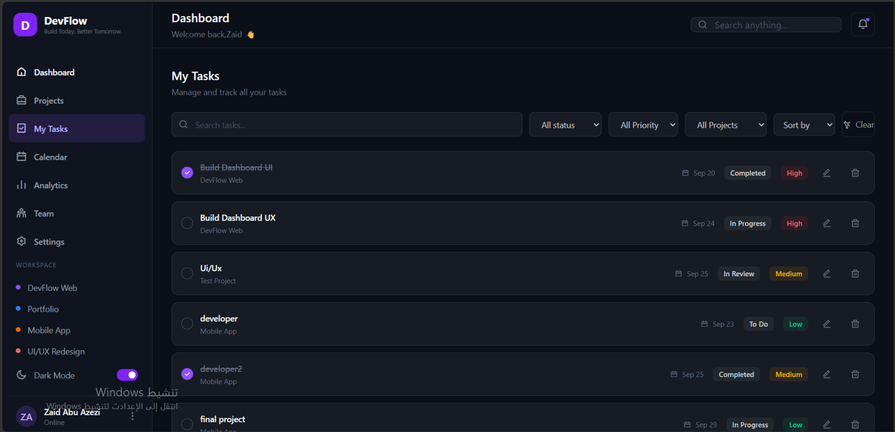

# DevFlow

DevFlow is a responsive project and task management dashboard built with HTML, Tailwind CSS, and Vanilla JavaScript.

## Preview

### Dashboard

### Projects

### My Tasks

## Features

- Create, edit, and delete tasks
- Create, edit, and delete projects
- Organize tasks by project
- Track task status and priority
- Mark tasks as completed
- Dynamic project progress based on completed tasks
- Search tasks by title or project
- Filter tasks by project, status, and priority
- Sort tasks by newest, due date, or priority
- Persistent data using Local Storage
- Responsive design for desktop, tablet, and mobile
- Mobile sidebar navigation

## Technologies Used

- HTML5
- Tailwind CSS
- Vanilla JavaScript
- Local Storage
- Remix Icon

## Project Structure

- `index.html` - Main application structure
- `input.css` - Tailwind CSS source file
- `main.css` - Compiled CSS file
- `app.js` - Application logic and functionality

## How to Run

1. Clone the repository.
2. Open the project folder.
3. Install the dependencies:

    npm install

4. Start the Tailwind CSS compiler:

    npx @tailwindcss/cli -i ./input.css -o ./main.css --watch

5. Open `index.html` in your browser.

## What I Learned

Through this project, I practiced:

- DOM manipulation
- JavaScript events
- Array methods such as `filter()`, `find()`, `some()`, and `forEach()`
- Working with objects and arrays
- Local Storage
- CRUD operations
- Filtering, searching, and sorting data
- Connecting tasks with projects using IDs
- Dynamic UI rendering
- Responsive design with Tailwind CSS
- Git and GitHub workflow

## Author

Zaid Abu Azezi